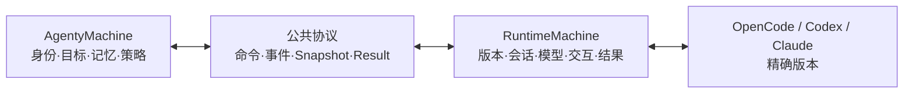

# Agenty Roadmap

> 状态：ACTIVE
>
> 最近更新：2026-09-06
>
> 路线图是真正的产品目标与阶段顺序；实时开发位置见 `pm-state.md`，历史变化见 `CHANGELOG.md`。

## 1. 产品目标

Agenty 的目标是成为具有推理、记忆和长期演进能力的 Agent 系统，而不是对某个模型 CLI 的简单包装。

初期复用 OpenCode、Codex CLI、Claude 等 Runtime 的模型、工具、会话和执行能力。Agenty 自己负责 Agent 身份、目标、记忆、策略和生命周期；Runtime 负责具体执行。两者必须通过稳定协议协作并能够独立演进。

## 2. 目标结构

项目采用“根级通用能力 + agents 下具体 Agent”的总分结构：

```text
agenty/
├── 配置与基础组件
├── Runtime 公共协议与 Adapter
├── MEMORY.md                 # 根级长期记忆入口
├── memory/                  # 共享记忆
├── skills/                  # 共享技能
└── agents/
    └── anna/
        ├── AGENTS.md        # Anna 的局部约束
        ├── memory/          # Anna 私有记忆（范围待设计）
        └── skills/          # Anna 私有或引用技能（范围待设计）
```

加载 Anna 时，先应用根级通用约束，再叠加 `agents/anna/AGENTS.md`。根级 `AGENTS.md` 是开发 Agent 的仓库接手说明，不等同于未来产品运行时的根级 `MEMORY.md`。

## 3. 双状态机路线



推进不是先完整做完一边，而是顶层需求与底层事实交替校准：

1. 从具体 Runtime 版本提炼可验证能力；
2. 形成 Runtime 中立协议和状态机；
3. 回到 AgentyMachine 检查是否足以表达 Agent 需求；
4. 再到底层补齐缺失事件与结果；
5. 在 Anna 的完整执行链路处交汇。

## 4. M1：第一个可运行 Agent Anna

状态：`ACTIVE`

M1 完成时，应用应能：

1. 从根级配置、共享记忆与共享技能开始加载；
2. 选择 `agents/anna/` 并叠加 Anna 的局部定义；
3. 由 AgentyMachine 建立目标、Environment、Action/Strategy 和执行上下文；
4. 通过独立 RuntimeMachine 选择精确 Runtime 类型与版本；
5. 创建或安全接续绑定 Project Environment 的 Runtime Session；
6. 选择经过能力验证的模型、effort 和交互策略；
7. 监控执行、处理授权/失败/额度并收集事件与 artifacts；
8. 把结果和必要记忆写回正确层级，完成可审计收尾；
9. 至少用 OpenCode 完成一次应用触发的端到端验收。

## 5. 已规划版本

### v0.01 — Runtime 接入基线（CODE_COMPLETE）

- 公共 Runtime 状态、事件、Identity 和 Snapshot。
- Pydantic v2 状态模型。
- Capability/Availability 状态机。
- OpenCode 1.18.26 无副作用版本与 help 探测。

### v0.03 — Runtime 最小 Turn 调用链（CODE_COMPLETE）

- 公共 TurnRequest、TurnStateData 和 TurnMachine。
- OpenCode 1.18.26 JSONL 执行 Adapter。
- 默认跳过、显式开启的真实 free 模型冒烟测试。

### v0.05 — RuntimeMachine 六类应用职责（ACTIVE）

| 功能分支 | 范围 | 状态 |
|---|---|---|
| v0.05-a | Runtime 类型与精确版本选择 | CODE_COMPLETE |
| v0.05-b | 厂商事件归一化与公共事件序列 | CODE_COMPLETE |
| v0.05-c | Session new/resume 与 ProjectEnvironment binding | CODE_COMPLETE |
| v0.05-d | 模型目录、模型/effort、desired/effective | CODE_COMPLETE |
| v0.05-e | ask/auto/deny/cancel 与授权审计 | CODE_COMPLETE |
| v0.05-f | 失败分类、usage、artifacts、事件日志与 TurnResult | PLANNED |

v0.05 完成不等于 M1 完成；它只完成 Anna 所依赖的 RuntimeMachine 底座。

## 6. M1 后续阶段（版本号尚未冻结）

版本号和边界必须在上一版本验收后由用户确认，以下只固定依赖顺序：

1. **根级基础能力与 AgentyMachine**：配置、Agent identity、目标、Environment、Action/Strategy、Reward 接口。
2. **层级加载协议**：根级约束与具体 Agent 局部约束的合并、优先级、路径安全和可观测结果。
3. **记忆与技能**：`MEMORY.md`、共享 `memory/skills`、Agent 私有范围、读取与写回策略。
4. **Anna 定义**：创建 `agents/anna/`，明确 Anna 的职责、记忆、技能和默认 Runtime 策略。
5. **双状态机编排**：应用触发 AgentyMachine，使用 RuntimeMachine 完成受控执行与收尾。
6. **M1 端到端验收**：真实 OpenCode 路径、失败恢复、审计信息、记忆写回和产物定位。

## 7. 当前差距

| 能力层 | 当前程度 | M1 尚缺 |
|---|---|---|
| RuntimeMachine | 六类职责完成前五类 | 监控与结果聚合 |
| AgentyMachine | 有边界与状态设计文档 | 可执行顶层状态机、Environment/Action/Reward |
| 层级目录 | 目标结构已确认 | 根级通用组件与 `agents/anna/` 尚未建立 |
| 记忆 | 原则已提出 | 共享/私有记忆模型、加载与写回均未实现 |
| 技能 | 目标层级已确认 | 共享/私有技能发现、组合与执行尚未实现 |
| Anna | 作为 M1 目标存在 | 身份、AGENTS、默认策略和端到端运行均未实现 |

因此项目已经有较扎实的 Runtime 底层，但距离“真正具备推理和记忆能力的 Anna”仍有多个版本，而不是一个功能分支。

## 8. 路线图约束

- 里程碑高于版本，一个里程碑由多个可独立验收版本组成。
- Runtime 能力必须与类型、精确版本、通道和证据等级共同表达。
- 公共协议不能泄漏厂商字段。
- Runtime Session 与项目 Environment 必须共同锁定。
- 原生 Session fork 不能单独代表执行分支；未来分支需要表达 `Env → Action(strategy) → Env' → Reward`。
- 每个功能分支完成后先自动回归，再由用户通过 IPython 或明确步骤验收。
- 未经用户确认，不提前冻结后续版本号，也不把未来全部目录一次性实现。
