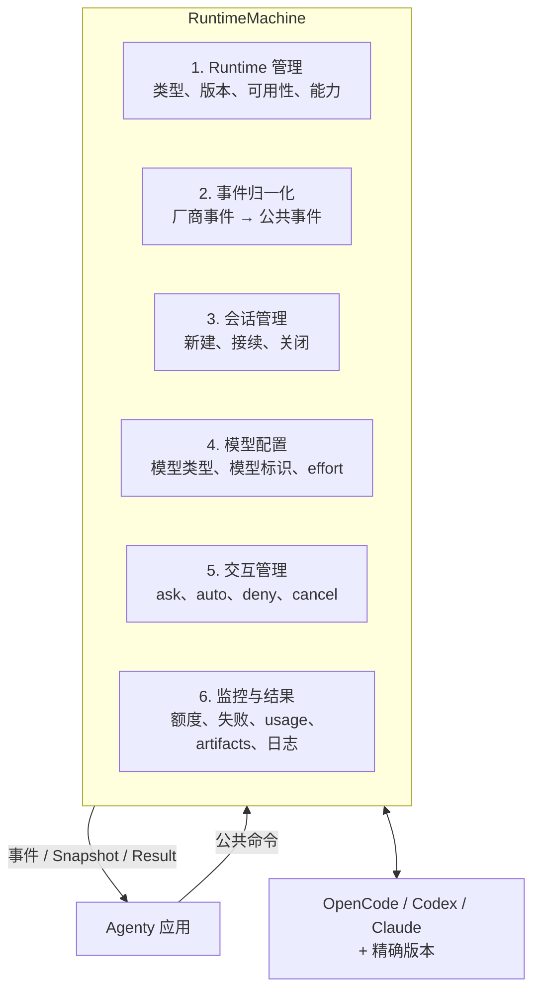
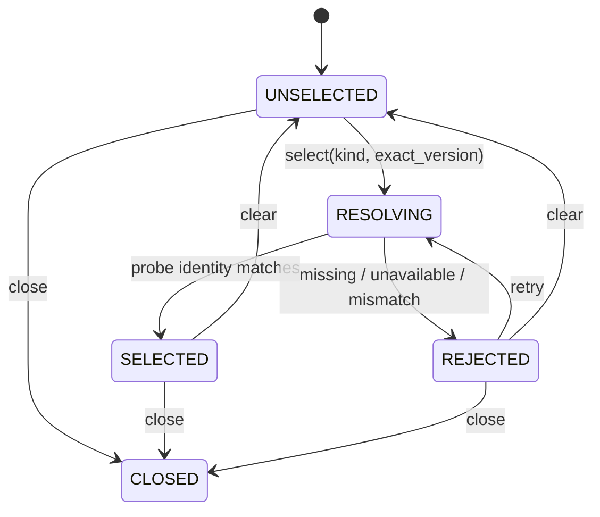
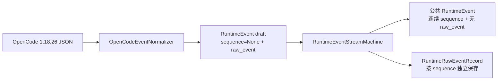
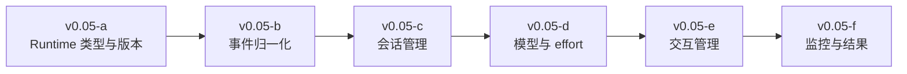

# RuntimeMachine 应用侧职责

> 状态：v0.05 回归与实现基线
>
> 首个实现：OpenCode 1.18.26

RuntimeMachine 对应用隐藏 CLI、进程和厂商事件，统一负责六类底层 Runtime 对接与管理。

## 1. Runtime 类型与版本

应用使用 `RuntimeTarget(kind, version)` 选择目标。Adapter 注册、探测结果和 capability 都必须绑定精确版本；找到同类 Runtime 但版本不同不能静默接受。

v0.05-a 已实现 `RuntimeAdapterRegistry` 和 `RuntimeSelectionMachine`：

未注册的精确版本不会回退到同类型其他版本；注册工厂异常、探测失败和身份不匹配都会形成结构化失败，而不会把状态遗留在 `RESOLVING`。

## 2. 事件归一化

厂商事件只能由对应版本 Adapter 解释。公共事件必须包含 Runtime、correlation、Session、Turn、顺序和时间上下文；原始事件只作为诊断证据，应用不能依赖其结构。

v0.05-b 已实现两层边界：

EventStream 状态为 `IDLE → ACTIVE → CLOSED`。只有 EventStream 可以分配公共 sequence；Runtime、correlation、Turn 和首次观察到的 Session ID 在流内锁定。上下文漂移、未知事件、畸形 JSON 和非法 Turn 生命周期均转换为 `invalid_output`，不会静默影响状态。

## 3. 会话管理

公共操作至少区分 `new` 和 `resume`。Session 必须和 Project Environment 绑定；Environment 不匹配时阻断接续，不能只凭原生 Session ID 恢复。

## 4. 模型选择

模型配置同时表达 desired 和 effective，至少包含模型类型/标识与 effort。RuntimeMachine 只有获得行为证据后才能宣称配置已经生效。

## 5. 交互管理

应用表达 `ask / auto_approve / auto_reject / deny_by_default` 等策略，Adapter 再映射到 Runtime。auto 必须显式开启并审计；通道不能弹出授权时必须通过 capability 拒绝 ask 模式。

## 6. 执行监控与结果

RuntimeMachine 将额度不足、限流、认证失败、模型不可用、超时、崩溃和非法输出归一化。最终结果包含输出、usage、failure、ArtifactManifest 与 EventLogRef，而不是只返回文本。

## 实施顺序

六类的测试清单是版本范围；每一类实现完成后都必须重跑前面所有类别的回归。
