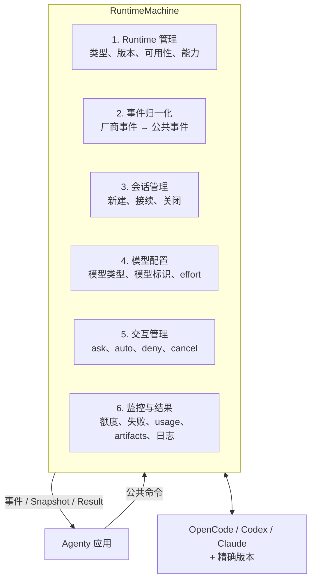
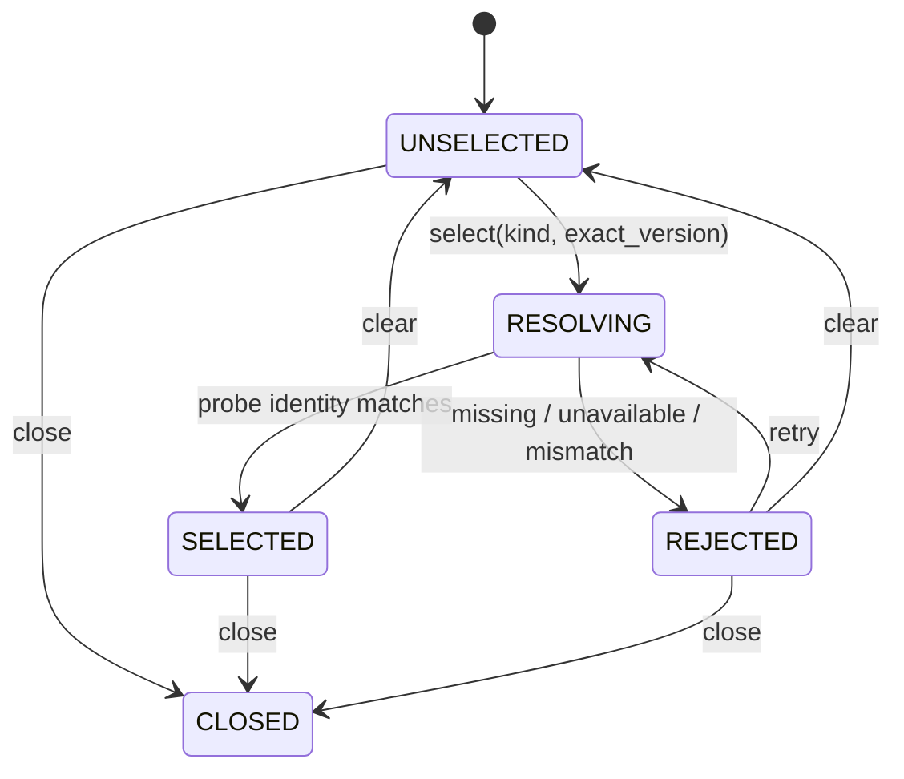
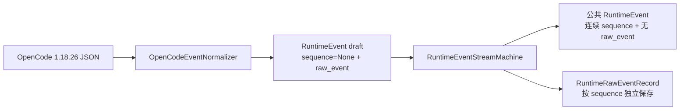
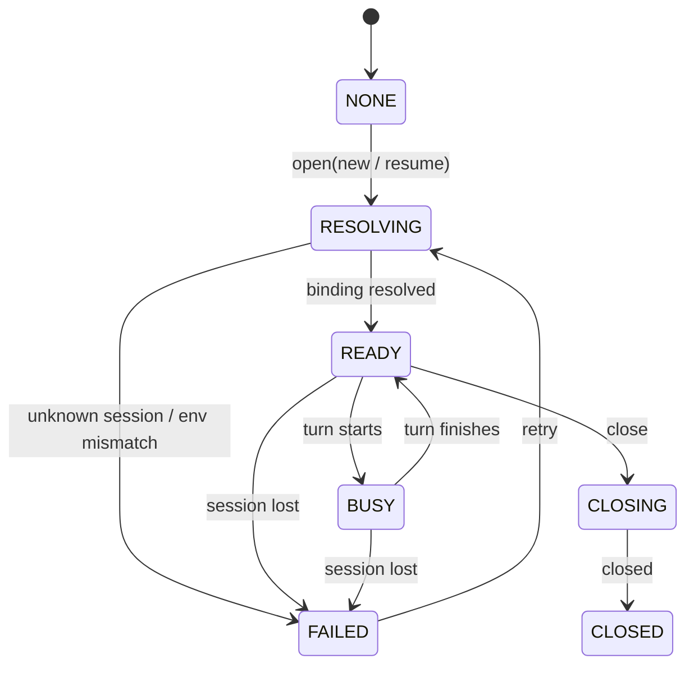
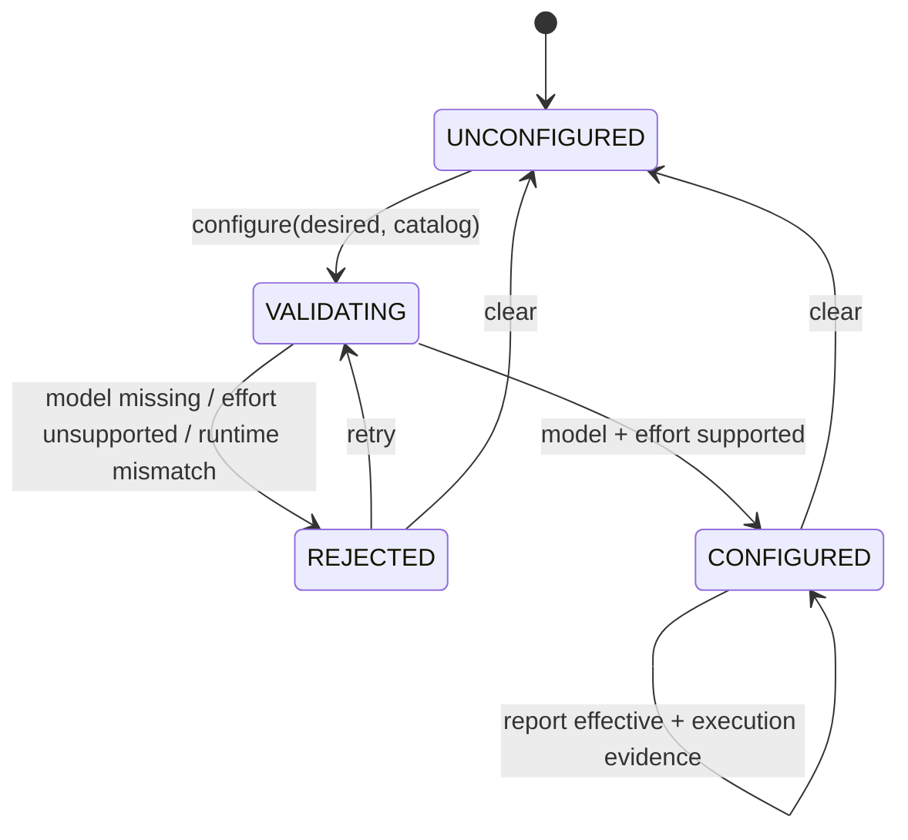
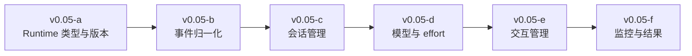

# RuntimeMachine 应用侧职责

> 状态：v0.05 回归与实现基线
>
> 首个实现：OpenCode 1.18.26

RuntimeMachine 对应用隐藏 CLI、进程和厂商事件，统一负责六类底层 Runtime 对接与管理。

## 1. Runtime 类型与版本

应用使用 `RuntimeTarget(kind, version)` 选择目标。Adapter 注册、探测结果和 capability 都必须绑定精确版本；找到同类 Runtime 但版本不同不能静默接受。

v0.05-a 已实现 `RuntimeAdapterRegistry` 和 `RuntimeSelectionMachine`：

未注册的精确版本不会回退到同类型其他版本；注册工厂异常、探测失败和身份不匹配都会形成结构化失败，而不会把状态遗留在 `RESOLVING`。

## 2. 事件归一化

厂商事件只能由对应版本 Adapter 解释。公共事件必须包含 Runtime、correlation、Session、Turn、顺序和时间上下文；原始事件只作为诊断证据，应用不能依赖其结构。

v0.05-b 已实现两层边界：

EventStream 状态为 `IDLE → ACTIVE → CLOSED`。只有 EventStream 可以分配公共 sequence；Runtime、correlation、Turn 和首次观察到的 Session ID 在流内锁定。上下文漂移、未知事件、畸形 JSON 和非法 Turn 生命周期均转换为 `invalid_output`，不会静默影响状态。

## 3. 会话管理

公共操作至少区分 `new` 和 `resume`。Session 必须和 Project Environment 绑定；Environment 不匹配时阻断接续，不能只凭原生 Session ID 恢复。

v0.05-c 将会话拆成三个公共对象：

- `ProjectEnvironment`：由应用分配的 Environment ID、Project ID、工作目录和可选 revision；
- `RuntimeSessionBinding`：精确 Runtime 实例/版本、原生 Session ID、Environment 和 lineage；
- `RuntimeSessionRequest`：明确表达 `new` 或 `resume`，其中 resume 必须给出 Session ID 和 Environment。

`RuntimeSessionBindingCatalog` 是可持久化 binding 状态的当前内存边界。接续流程先按 Runtime identity 与 Session ID 找到 binding，再对完整 Environment 做相等校验；失败时不调用 Runtime。通过校验后，OpenCode 1.18.26 Adapter 才映射为 `--session <id>`，且返回事件中的 Session ID 必须保持一致。`--continue` 和 `--fork` 不参与此流程。

Session lineage 当前记录创建来源和可选 `parent_session_id`。v0.05-c 只实现 new/resume；fork 与 `Env → Action(strategy) → Env' → Reward` 仍由后续版本扩展，不把原生 fork 等同于 Agenty 执行分支。

## 4. 模型选择

模型配置同时表达 desired 和 effective，至少包含模型类型/标识与 effort。RuntimeMachine 只有获得行为证据后才能宣称配置已经生效。

v0.05-d 使用以下公共对象：

- `RuntimeModelRef`：分离模型类型、provider ID 和 model ID；
- `RuntimeModelSelection`：模型引用与可选 effort；
- `RuntimeModelDescriptor`：绑定精确 Runtime identity、支持的 effort 和证据；
- `RuntimeModelCatalog`：一个 Runtime 实例和版本下的可选模型集合；
- `RuntimeModelBinding`：通过目录校验后，交给 Turn 的不可变选择凭证。

effort 是配置值，不是生命周期状态。`desired` 永远保存应用请求；`effective` 只在获得 `integration_verified` 或 `live_verified` 执行证据后单独写入，即使 Runtime 实际值不同也不覆盖 desired。

OpenCode 1.18.26 Adapter 用 `models --verbose` 建立 `probe_verified` 目录，将 `providerID/id` 映射为模型身份、将 `variants` 键映射为该模型支持的 effort。通过 `RuntimeModelSelectionMachine` 的 binding 才能进入 Turn，并分别映射到 `--model provider/model` 与 `--variant effort`。目录证据只证明选项存在，不证明一次 Turn 实际采用了该值。

## 5. 交互管理

应用表达 `ask / auto_approve / auto_reject / deny_by_default` 等策略，Adapter 再映射到 Runtime。auto 必须显式开启并审计；通道不能弹出授权时必须通过 capability 拒绝 ask 模式。

v0.05-e 已实现 `RuntimeInteractionMachine`、`RuntimeInteractionPolicy`、审批请求/决策和独立审计事件。默认策略是 `deny_by_default`；实际权限请求发生后，自动批准、自动拒绝和人工决定都记录 actor、时间、结果与 request ID。支持审批往返的 Channel 可以通过 Runner 的活动交互快照发现请求，并通过 `reply_approval` 恢复 `WAITING_APPROVAL` Turn；回复只有在 Adapter 接收成功后才写入决定审计，等待超时进入 `TIMED_OUT`。取消请求通过控制信号回收运行进程并进入 `CANCELLED`。

OpenCode 1.18.26 `transient_process + run --format json` 的能力边界为：显式 `auto_approve` 映射到 `--auto`；默认、`auto_reject` 和 `deny_by_default` 不添加 auto 参数；该 Channel 没有可验证的审批回复控制面，因此 `ask` 在启动前被 capability guard 拒绝。取消由 Adapter 进程控制实现，不把厂商能力推断成公共审批能力。

## 6. 执行监控与结果

RuntimeMachine 将额度不足、限流、认证失败、模型不可用、超时、崩溃和非法输出归一化。最终结果包含输出、usage、failure、ArtifactManifest 与 EventLogRef，而不是只返回文本。

v0.05-f 已实现以下公共结果边界：

- `RuntimeUsage` 聚合输入、输出、reasoning、cache token、费用和 provider evidence reference；畸形、负数、布尔值或非有限费用不能静默变成零。
- `RuntimeFailure` 区分 rate limit、quota、authentication、model unavailable、timeout、crash 和 invalid output。OpenCode 1.18.26 的安全 reason 比通用 HTTP/text 启发式优先，`FreeUsageLimitError` 映射为 rate limited。
- `ArtifactManifest` 保存 Turn 前后普通文件内容差异的相对路径、media type、大小与 SHA-256。文件系统观察不能证明生产者，因此当前 producer 为 `unknown:filesystem_observation`。
- `EventLogRef` 指向每次执行独立目录中的 normalized/raw JSONL，记录 SHA-256 和事件数量；目录和文件分别以 `0700`、`0600` 创建，配置目录不安全或不可写时使用私有临时目录。
- `TurnResult` 同时保存请求、终态、Session、输出、usage、failure、artifacts、事件和日志引用。JSON 恢复时重新校验请求上下文、连续 sequence、终态事件、failure、输出与 usage 的一致性。

Runner 的活动生命周期由外层 `finally` 清理；工作区扫描、Adapter、失败事件构造或结果存储异常都不能把 Runner 永久留在 active。Adapter 的终态事件在事件源结束后提交，因此终态后的额外事件会被识别为非法输出，而不是形成自相矛盾的结果。

当前边界不宣称完整因果审计：事件日志是终态后的 evidence export，不是逐事件 fsync 的 crash-safe journal；ArtifactManifest 不记录删除、symlink 或仅元数据变化，也不能排除执行期间其他进程的文件修改。`scan_complete` 与 `limitations` 用于向消费者暴露这些限制。原始证据目前没有长期 retention、redaction 或 cleanup policy。

## 实施顺序

六类的测试清单是版本范围；每一类实现完成后都必须重跑前面所有类别的回归。
