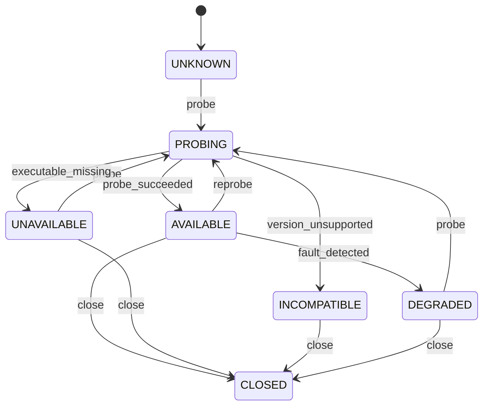
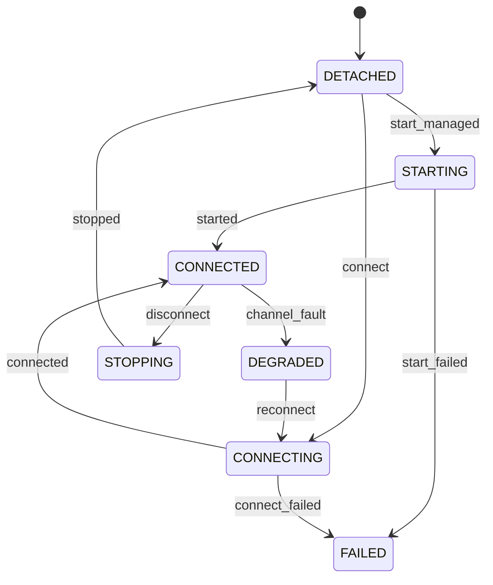
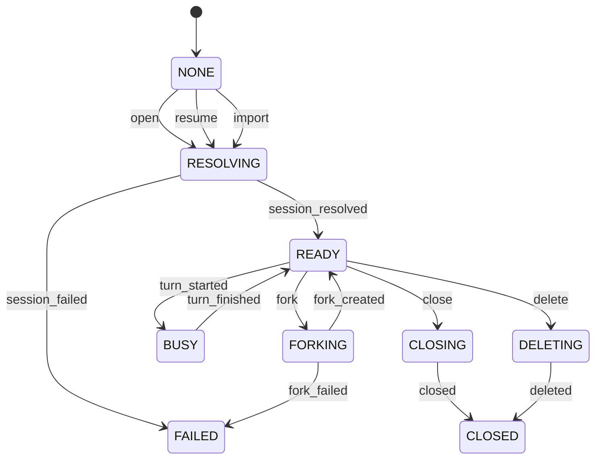
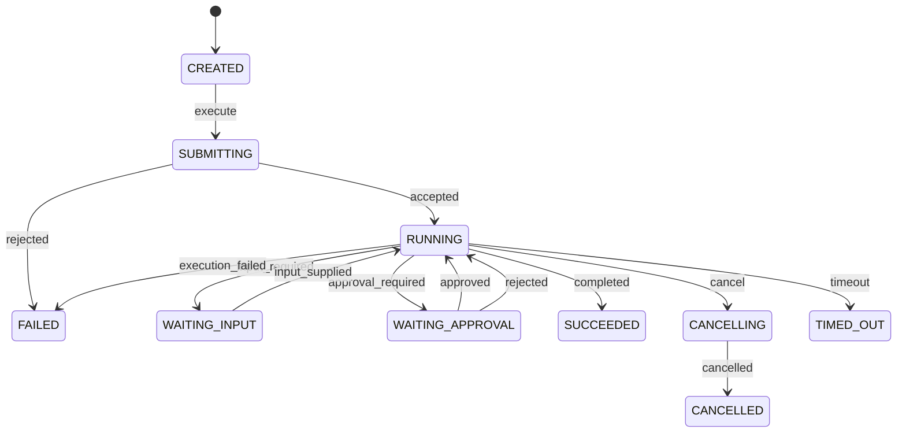

# Runtime Machine 设计

> 状态和事件的独立讨论基线见 [RuntimeMachine 状态与事件清单](runtime-states-events.md)。

## 1. 定位

RuntimeMachine 是一个聚合状态机。它管理某个明确的 `Runtime + 版本`，并通过具体接入通道控制配置、Session 和 Turn。

```text
RuntimeMachine
├── AvailabilityMachine   安装、版本、兼容性
├── ChannelMachine        CLI / Server / ACP / Window
├── SessionMachine        创建、恢复、分叉、关闭
└── TurnMachine           一次输入的提交、执行、交互和结果
```

采用多个有层级关系的小状态机，而不是把所有组合展开成一个巨大枚举。

## 2. 标识

Runtime 实例由以下字段共同确定：

```text
runtime_id
runtime_kind
runtime_version
channel
endpoint/process identity
```

例如：

```text
runtime_id: local-opencode
runtime_kind: opencode
runtime_version: 1.18.26
channel: cli-run-local
```

## 3. AvailabilityMachine

管理 Runtime 是否存在、版本是否可识别以及当前是否可用于继续连接。



这里使用 `AVAILABLE`，不使用含义过宽的 `READY`。Runtime 只有可用，并不代表通道、Session 或配置已经就绪。

## 4. ChannelMachine

管理连接到 Runtime 的方式。通道模式是配置，连接情况是状态。

```text
channel mode:
  transient_process
  managed_server
  remote_server
  acp
  interactive_window
```



`cli-run-local` 是 transient channel：每个 Turn 内部临时建立，Turn 结束后回收。`serve`、`attach` 和 ACP 才可能形成跨 Turn 的长期连接。

## 5. SessionMachine

Session 是 Runtime 内部的对话历史容器，不等同于 Agenty Agent。

Session fork 也不等同于完整的 Agenty 执行分支。执行分支还必须绑定项目环境，需求基线见 [执行分支上下文需求](execution-branch-context.md)。



Session 的 `READY/BUSY` 表达是否有活跃 Turn；具体执行细节由 TurnMachine 管理。

## 6. TurnMachine

一个用户输入产生一个独立 Turn。Turn 有自己的终态，不在完成后复用同一个状态对象。



并非每个通道都支持 `WAITING_INPUT/WAITING_APPROVAL`。状态图表达公共上限，具体通道通过 capability guard 决定转移是否合法。

对 OpenCode 1.18.26 `cli-run-local --format json`：

- 支持 `CREATED → SUBMITTING → RUNNING`。
- 成功终态需要从进程成功退出和 JSON 无 error 推导。
- 当前不支持进入 `WAITING_APPROVAL`，因为权限请求会被 CLI 自动拒绝或在 `--auto` 下自动批准。

## 7. 配置作用域

配置必须有作用域，不能全部塞进 Runtime 全局状态：

```text
RuntimeProfile
  executable, channel, endpoint, authentication, plugin_policy

SessionConfig
  workspace, title, runtime_agent, permission_policy

TurnConfig
  model, effort, prompt, attachments, show_reasoning
```

RuntimeMachine 保存 `desired_config` 和 `effective_config`。应用配置变更时先验证 capability，再在合适边界生效；不能仅因字段写入成功就宣称已经切换。

## 8. 公共命令

```text
probe_runtime
open_channel / close_channel
open_session / resume_session / fork_session
submit_turn
supply_input
reply_approval
cancel_turn
close_session / delete_session
close_runtime
```

## 9. 公共事件

```text
runtime.probing / available / unavailable / incompatible / degraded
channel.starting / connected / failed / detached
session.resolving / ready / busy / failed / closed
turn.submitting / running / output / waiting_input / waiting_approval
turn.succeeded / failed / cancelling / cancelled / timed_out
```

所有事件包含：

```text
runtime_id
runtime_kind
runtime_version
channel
session_id（适用时）
turn_id（适用时）
correlation_id
timestamp
payload
raw_event（可选，诊断用途）
```

## 10. 能力模型

能力记录不是布尔集合，而是带作用域和证据的声明：

```text
RuntimeCapabilityRecord
  capability
  runtime identity（必须包含 version 和 channel）
  support: supported / unsupported / conditional / unknown
  evidence: unknown / advertised / source_confirmed / probe_verified /
            integration_verified / live_verified
  evidence_source
  constraints
```

v0.01-b 使用 Pydantic v2 BaseModel 实现该记录，代码位于 `src/agenty/runtime/protocol.py`。`conditional` 必须附带约束，除 `unknown` 外的支持声明必须有证据。

状态数据遵循 andybot 的边界：Enum 表达状态，Pydantic 模型负责校验、序列化和恢复，Machine 负责转移及运行时行为。

例如：

```text
capability: interactive_approval
runtime: opencode@1.18.26
channel: cli-run-local
support_status: unsupported
evidence_level: source_confirmed
constraint: permission requests are auto-rejected unless --auto
```

## 11. 当前实现与设计差距

v0.01-c 已将 OpenCode 1.18.26 Probe 迁移到公共协议：

1. 通用 `RuntimeProbeMachine` 只负责编排公共 Availability 事件，OpenCode 细节留在独立 Adapter。
2. 缺失、命令不可用、版本格式错误和版本不受支持具有不同的结构化失败代码。
3. 版本通过后、能力探测失败时进入 `DEGRADED`，保留已经确认的 Runtime 身份。
4. `--help` 中出现的参数只生成 `support=unknown`、`evidence=advertised` 的记录。
5. 探测只执行 `opencode --version` 和 `opencode run --help`，不调用模型、不创建 Session。

本机 OpenCode 1.18.26 已真实通过该无副作用探测，结果为 `AVAILABLE`，并发现 8 条 advertised 能力记录。

尚未实现 Channel、Session、Turn 的运行行为，也尚未验证模型切换、effort、Session 恢复或分叉的实际效果；这些不能由本版本的 help 探测推导。

## 12. 不变量

- RuntimeMachine 不能修改 AgentyMachine 状态，只发布公共事件。
- AgentyMachine 不能读取 Runtime 适配器的进程或连接对象。
- 能力必须绑定 Runtime、版本和通道。
- 模型与 effort 是配置，不是状态。
- 默认不启用自动批准。
- 原始事件必须先归一化，才能影响公共状态。
